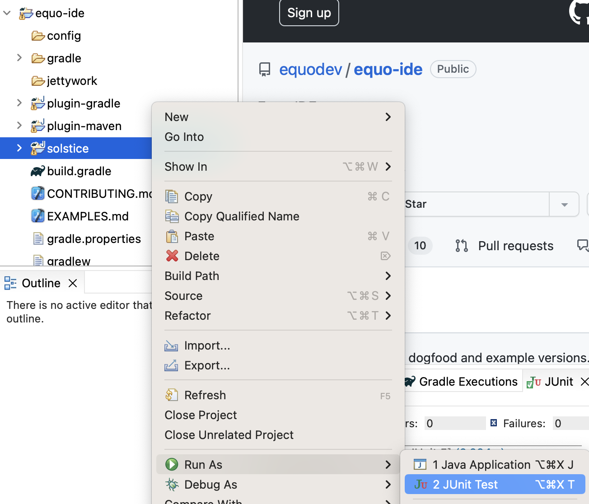

# EquoIDE and Solstice Contributing Guide

We use EquoIDE to develop EquoIDE and Solstice. Clone this repo, cd into its root directory, and run `gradlew equoIde`.

The first time you launch it, watch the status bar at the bottom as the Gradle project gets imported. Once it's done you're ready to develop!

A good place to start is running the Solstice tests by right-clicking the solstice project and doing `Run As -> JUnit Test`.

## Developer's Guide

TODO