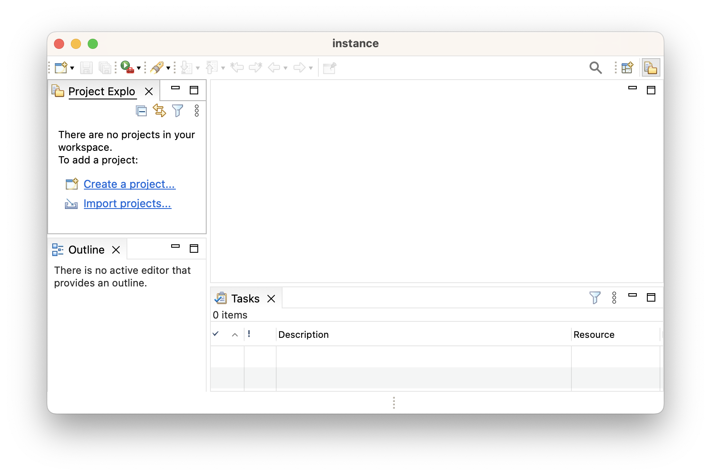

# P2 Multitool

[//]: <> (UPDATE CHECKLIST)
[//]: <> (update version in plugin-gradle/example-gradle/build.gradle)
[//]: <> (update version in plugin-maven/example-maven/pom.xml)
[//]: <> ($ rm *.tar)
[//]: <> ($ ./gradlew p2multitool)
[//]: <> ($ cp p2multi<tab> p2multitool-latest.tar)
[//]: <> (find-replace existing '0.12.1' with '$NEW' in this document)

The EquoIDE maven and gradle plugins can help you browse and debug p2 repositories. If you'd like to follow along and modify the examples to suit your problem, just download [`p2multitool-0.12.1.tar`](https://github.com/equodev/equo-ide/raw/main/p2multitool-0.12.1.tar) and extract it to a directory of your choice - you don't need to install anything else (besides a JDK on your system path).

## Command reference

- [`equoList --all=categories`](#equolist-all)
  - `equoList --all=features`
  - `equoList --all=jars`
- [`equoList --installed`](#equolist-installed)
- [`equoList --problems`](#equolist-problems)
- [`equoList --optional`](#equolist-optional)
- [`equoList --detail=any.unit.id`](#equolist-detail)
- [`equoList --raw=any.unit.id`](#equolist-raw)
- (any command) `--format=csv` to output diff-friendly CSV instead of the default `ascii` table
- [`equoIde --init-only`](#equoide-init-only)

## Maven vs Gradle

The examples below are all in Gradle syntax because it is more compact, but it is trivial to map from the Gradle to Maven. The examples in [`p2multitool-0.12.1.tar`](https://github.com/equodev/equo-ide/raw/main/p2multitool-0.12.1.tar) include both `pom.xml` and `build.gradle`, as well as `gradlew` and `mvnw`, so you can use whatever is most convenient. 

Here is a rosetta stone to help map:

```console
user@machine p2-multitool % ./gradlew equoList --all=categories
user@machine p2-multitool % ./mvnw equo-ide:list -Dall=categories

user@machine p2-multitool % ./gradlew equoList --installed
user@machine p2-multitool % ./mvnw equo-ide:list -Dinstalled

user@machine p2-multitool % ./gradlew equoIde
user@machine p2-multitool % ./mvnw equo-ide:launch
```

```gradle
// build.gradle
plugins { id 'dev.equo.ide' version '0.12.1' }
equoIde {
  p2repo 'https://download.eclipse.org/eclipse/updates/4.26/'
  install 'org.eclipse.platform.ide.categoryIU'
}
```

```xml
<!--pom.xml-->
<build><plugins><plugin>
  <groupId>dev.equo.ide</groupId> <artifactId>equo-ide-maven-plugin</artifactId> <version>0.12.1</version>
   <configuration>
     <p2repos>
       <p2repo>https://download.eclipse.org/eclipse/updates/4.26/</p2repo>
     </p2repos>
     <installs>
       <install>org.eclipse.platform.ide.categoryIU</install>
     </installs>
  </configuration>
</plugin></plugins></build>
```

We're hoping to make the maven DSL more compact in the future ([#57](https://github.com/equodev/equo-ide/issues/57)).

## Quickstart

In this tutorial we're going to start with nothing, then get a stripped-down Eclipse IDE, then get a full [Corrosion Rust IDE](https://github.com/eclipse/corrosion) running.

<a name="equolist-all"></a>
### `equoList --all=categories` (or `features` or `jars`)

```gradle
// build.gradle
plugins { id 'dev.equo.ide' version '0.12.1' }
equoIde {
  p2repo 'https://download.eclipse.org/eclipse/updates/4.26/'
}
```

To start, `cd` into the multitool directory where you'll see the `build.gradle` and then run `./gradlew equoList --all=categories`.

- (On windows, replace `ls` with `dir` and replace `./gradlew` with `gradlew`)

[//]: <> (P2MultitoolExamples._01_minimal_allCategories)
```console
user@machine p2-multitool % ./gradlew equoList --all=categories
+----------------------------------------------+---------------------------------------------------+
| id                                           | name \n description                               |
+----------------------------------------------+---------------------------------------------------+
...
| org.eclipse.platform.ide.categoryIU          | Eclipse Platform                                  |
|                                              |   Minimum version of Eclipse: no source or API    |
|                                              |   documentation, no PDE or JDT.                   |
| org.eclipse.rcp.categoryIU                   | Eclipse RCP Target Components                     |
|                                              |   Features to use as PDE runtime target, while    |
|                                              |   developing RCP applications.                    |
| org.eclipse.releng.java.languages.categoryIU | Eclipse Java Development Tools                    |
|                                              |   Tools to allow development with Java.           |
| org.eclipse.releng.pde.categoryIU            | Eclipse Plugin Development Tools                  |
|                                              |   Tools to develop bundles, plugins and features. |
| org.eclipse.sdk.ide.categoryIU               | Eclipse SDK                                       |
|                                              |   The full version of Eclipse, with source and    |
|                                              |   documentation: Platform, JDT and PDE.           |
+----------------------------------------------+---------------------------------------------------+
```

In addition to `--all=categories`, you can also pass `--all=features` or `--all=jars`.

- A category is the highest-level p2 concept, representing an entire "product"
- A feature is a collection of jars and other features, representing a single "feature"
  - could be a high level feature like `org.eclipse.jdt` (Eclipse Java Development Tools)
  - or a fine-grained feature like `org.eclipse.jdt.ui.unittest.junit` (JUnit Test runner client for UnitTest View)
- A jar is a literal `somefile.jar`.

<a name="equolist-installed"></a>
### `equoList --installed`

Ultimately, the point of `equoList` is to make sure we've got all of the jars we need for `equoIde` to run. That is a function of:

- the repositories we specify
- the units we install
- the units we filter out and exclude

```gradle
// build.gradle
equoIde {
  p2repo 'https://download.eclipse.org/eclipse/updates/4.26/'
}
```

[//]: <> (P2MultitoolExamples._02_minimal_installed_empty)
```console
user@machine p2-multitool % ./gradlew equoList --installed
No jars were specified.
```

We haven't specified anything that we want installed, so there are no jars. Looking back at the categories from the first command,

```console
user@machine p2-multitool % ./gradlew equoList --all=categories
...
| org.eclipse.platform.ide.categoryIU | Eclipse Platform                               |
|                                     |   Minimum version of Eclipse: no source or API |
|                                     |   documentation, no PDE or JDT.                |
```

Minimum version of Eclipse seems like a good place to start, let's try installing that.

```gradle
// build.gradle
equoIde {
  p2repo 'https://download.eclipse.org/eclipse/updates/4.26/'
  install 'org.eclipse.platform.ide.categoryIU'
}
```

[//]: <> (P2MultitoolExamples._02_minimal_installed)
```console
user@machine p2-multitool % ./gradlew equoList --installed
0 unmet requirement(s), 0 ambigous requirement(s). For more info: `gradlew equoList --problems`
60 optional requirement(s) were not installed. For more info: `gradlew equoList --optional`
+-------------------------------------------+---------------+
| maven coordinate / p2 id                  | repo          |
+-------------------------------------------+---------------+
| com.ibm.icu:icu4j:72.1                    | maven central |
| commons-io:commons-io:2.11.0              | maven central |
| jakarta.servlet:jakarta.servlet-api:4.0.4 | maven central |
...
```

It says `0 unmet requirements`, let's see if that's really true with `./gradlew equoIde` (or `./mvnw equo-ide:launch`).



Awesome! A running IDE! Obviously we're going to want more than just the bare minimum, so let's look a little closer to see what's going on.

[//]: <> (P2MultitoolExamples._02_minimal_installed - same as above)
```console
user@machine p2-multitool % ./gradlew equoList --installed
0 unmet requirement(s), 0 ambigous requirement(s). For more info: `gradlew equoList --problems`
60 optional requirement(s) were not installed. For more info: `gradlew equoList --optional`
+------------------------------------------------------+------------------------+
| maven coordinate / p2 id                             | repo                   |
+------------------------------------------------------+------------------------+
| com.ibm.icu:icu4j:72.1                               | maven central          |
| commons-io:commons-io:2.11.0                         | maven central          |
...
| org.eclipse.ecf:org.eclipse.ecf.filetransfer:5.1.102 | maven central?         |
| org.eclipse.ecf:org.eclipse.ecf.identity:3.9.402     | maven central?         |
...
| com.jcraft.jsch:0.1.55.v20221112-0806                | p2 R-4.26-202211231800 |
| com.sun.el:2.2.0.v201303151357                       | p2 R-4.26-202211231800 |
+------------------------------------------------------+------------------------+
```

The first thing to note is that some dependencies come from `mavenCentral`, which means that the p2 metadata declares *exactly* where on `mavenCentral` that jar comes from. Other dependencies come from `mavenCentral?`, which means that [our (possibly flawed) heuristic](https://github.com/equodev/equo-ide/blob/main/solstice/src/main/java/dev/equo/solstice/p2/MavenCentralMapping.java) has identified that the jar is available on `mavenCentral`. And the rest of the jars will come from `p2`.

## Advanced usage

Now that we have started a minimal IDE and we understand where the jars are coming from, let's try something harder: the [Eclipse Corrosion](https://github.com/eclipse/corrosion) tooling for Rust.

The first thing we need to do is add the update site and look at what categories are available.

[//]: <> (P2MultitoolExamples._03_corrosion_allCategories)
```gradle
// build.gradle
equoIde {
  p2repo 'https://download.eclipse.org/eclipse/updates/4.26/'
  install 'org.eclipse.platform.ide.categoryIU'
  // corrosion
  p2repo 'https://download.eclipse.org/corrosion/releases/1.2.4/'
}
```

```console
user@machine p2-multitool % ./gradlew equoList --all=categories
+-------------------------------------------------+---------------------------------------------------+
| id                                              | name \n description                               |
+-------------------------------------------------+---------------------------------------------------+
| 202206282034.Default                            | Uncategorized                                     |
|                                                 |   Default category for otherwise uncategorized    |
|                                                 |   features                                        |
| 202206282034.org.eclipse.corrosion.category     | Corrosion: Rust edition in Eclipse IDE            |
|                                                 |   Corrosion enables Rust application development  |
|                                                 |   in the Eclipse IDE.                             |
| 202206282034.org.eclipse.corrosion.dev.category | Developer Resources                               |
|                                                 |   Useful resources for Corrosion contributors     |
|                                                 |   and integrators.                                |
...
```

Looks like `202206282034.org.eclipse.corrosion.category` is that we want. Let's see how that installation looks.

```gradle
// build.gradle
equoIde {
  p2repo 'https://download.eclipse.org/eclipse/updates/4.26/'
  install 'org.eclipse.platform.ide.categoryIU'
  // corrosion
  p2repo 'https://download.eclipse.org/corrosion/releases/1.2.4/'
  install '202206282034.org.eclipse.corrosion.category'
}
```

[//]: <> (P2MultitoolExamples._04_corrosion_installed)
```console
user@machine p2-multitool % ./gradlew equoList --installed
WARNING!!! 14 unmet requirement(s), 786 ambigous requirement(s).
WARNING!!!  For more info: `gradlew equoList --problems`
62 optional requirement(s) were not installed. For more info: `gradlew equoList --optional`
+---------------------------------------------------------------------------------+------------------------+
| maven coordinate / p2 id                                                        | repo                   |
+---------------------------------------------------------------------------------+------------------------+
| com.google.code.gson:gson:2.9.1                                                 | maven central          |
| com.ibm.icu:icu4j:72.1                                                          | maven central          |
| commons-io:commons-io:2.11.0                                                    | maven central          |
...
```

We could try `equoIde` here, but `14 unmet requirement(s)` seems like a problem. Let's see what we can do about it.

<a name="equolist-problems"></a>
### `equoList --problems`

[//]: <> (P2MultitoolExamples._05_corrosion_problems)
```console
user@machine p2-multitool % ./gradlew equoList --problems
14 unmet requirement(s).
+----------------------------------------+-----------------------------------------------------------+
| unmet requirement                      | needed by                                                 |
+----------------------------------------+-----------------------------------------------------------+
| java.package:com.google.common.base    | org.eclipse.lsp4e:0.13.12.202206011407                    |
|                                        | org.eclipse.lsp4j:0.14.0.v20220526-1518                   |
|                                        | org.eclipse.mylyn.wikitext:3.0.42.20220107230029          |
|                                        | org.eclipse.mylyn.wikitext.markdown:3.0.42.20220107230029 |
| java.package:com.google.common.collect | org.eclipse.mylyn.wikitext:3.0.42.20220107230029          |
|                                        | org.eclipse.mylyn.wikitext.markdown:3.0.42.20220107230029 |
...
| osgi.bundle:org.eclipse.cdt.core       | org.eclipse.corrosion:1.2.4.202206282034                  |
| osgi.bundle:org.eclipse.cdt.debug.core | org.eclipse.corrosion:1.2.4.202206282034                  |
| osgi.bundle:org.eclipse.cdt.debug.ui   | org.eclipse.corrosion:1.2.4.202206282034                  |
...
786 ambiguous requirement(s).
+------------------------------------------------------------------------------------------------+--------------------------------------------------------------------------------------------+-----------+
| ambiguous requirement                                                                          | candidate                                                                                  | installed |
+------------------------------------------------------------------------------------------------+--------------------------------------------------------------------------------------------+-----------+
| java.package:com.google.gson                                                                   | com.google.gson:2.9.1                                                                      | [x]       |
|                                                                                                | com.google.gson:2.8.9.v20220111-1409                                                       | [ ]       |
| java.package:com.google.gson.annotations                                                       | com.google.gson:2.9.1                                                                      | [x]       |
|                                                                                                | com.google.gson:2.8.9.v20220111-1409                                                       | [ ]       |
...
```

Okay so first thing - with 786 problems, it might be easier to try

```
unix    ./gradlew equoList --problems | less
windows   gradlew equoList --problems | more 
```

The thing that sticks out is that many of the missing bundles are `org.eclipse.cdt`. Probably we should add the CDT update site. Let's try it!

```gradle
// build.gradle
equoIde {
  p2repo 'https://download.eclipse.org/eclipse/updates/4.26/'
  install 'org.eclipse.platform.ide.categoryIU'
  // corrosion
  p2repo 'https://download.eclipse.org/corrosion/releases/1.2.4/'
  install '202206282034.org.eclipse.corrosion.category'
  // cdt transitives for corrosion
  p2repo 'https://download.eclipse.org/tools/cdt/releases/11.0/'
}
```

[//]: <> (P2MultitoolExamples._06_corrosion_cdt_installed)
```console
user@machine p2-multitool % ./gradlew equoList --installed
WARNING!!! 5 unmet requirement(s), 805 ambigous requirement(s).
WARNING!!!  For more info: `gradlew equoList --problems`
62 optional requirement(s) were not installed. For more info: `gradlew equoList --optional`
...
```

<a name="equolist-optional"></a>
### `equoList --optional`

```console
user@machine p2-multitool % ./gradlew equoList --optional
+------------------------------------+---------------------------------------------+---------------------------------------------------------+
| requirement (not installed)        | provided by                                 | optionally needed by                                    |
+------------------------------------+---------------------------------------------+---------------------------------------------------------+
| org.apache.avalon.framework.logger | -- none available --                        | org.apache.commons.logging:1.2.0.v20180409-1502         |
| org.apache.commons.fileupload      | org.apache.commons.commons-fileupload:1.4.0 | org.eclipse.equinox.http.servlet:1.7.400.v20221006-1531 |
| org.apache.felix.service.command   | org.apache.felix.gogo.runtime:1.1.6         | org.apache.felix.scr:2.2.4                              |
...
```

<a name="equolist-detail"></a>
### `equoList --detail=any.unit.id`

Let's dig in to one of the ambiguous parts above - that the java package `org.eclipse.jdt.internal.compiler.apt.dispatch` (and others) is provided by both `org.eclipse.jdt.compiler.apt` and `org.eclipse.jdt.core.compiler.batch`. Which one do we actually want?

[//]: <> (P2MultitoolExamples._05)
```console
user@machine p2-multitool % ./gradlew equoList --detail=org.eclipse.jdt.compiler.apt
1 unit available with id org.eclipse.jdt.compiler.apt
  1.4.300.v20221108-0856  [x] included by install
+--------------------------------------------+-------------------------------------------------------------+
| key                                        | value                                                       |
+--------------------------------------------+-------------------------------------------------------------+
| id                                         | org.eclipse.jdt.compiler.apt                                |
| version                                    | 1.4.300.v20221108-0856                                      |
| maven coordinate                           | org.eclipse.jdt:org.eclipse.jdt.compiler.apt:1.4.300        |
| maven repo                                 | maven central?                                              |
| prop artifact-classifier                   | osgi.bundle                                                 |
| prop maven-artifactId                      | org.eclipse.jdt.compiler.apt                                |
| prop maven-groupId                         | org.eclipse.jdt                                             |
| prop maven-type                            | eclipse-plugin                                              |
| prop maven-version                         | 1.4.300-SNAPSHOT                                            |
| prop org.eclipse.equinox.p2.name           | Java Compiler Apt                                           |
| req org.eclipse.jdt.internal.compiler.tool | 2 available                                                 |
|                                            |   org.eclipse.jdt.compiler.tool:1.3.200.v20220802-0458      |
|                                            |   org.eclipse.jdt.core.compiler.batch:3.32.0.v20221108-1853 |
| req org.eclipse.jdt.core                   | org.eclipse.jdt.core:3.32.0.v20221108-1853                  |
+--------------------------------------------+-------------------------------------------------------------+

user@machine p2-multitool % ./gradlew equoList --detail=org.eclipse.jdt.core.compiler.batch
1 unit available with id org.eclipse.jdt.core.compiler.batch
  3.32.0.v20221108-1853  [ ] not included by install
+----------------------------------+-------------------------------------+
| key                              | value                               |
+----------------------------------+-------------------------------------+
| id                               | org.eclipse.jdt.core.compiler.batch |
| version                          | 3.32.0.v20221108-1853               |
| maven coordinate                 | org.eclipse.jdt:ecj:3.32.0          |
| maven repo                       | maven central?                      |
| prop artifact-classifier         | osgi.bundle                         |
| prop maven-artifactId            | org.eclipse.jdt.core                |
| prop maven-groupId               | org.eclipse.jdt                     |
| prop maven-type                  | eclipse-plugin                      |
| prop maven-version               | 3.32.0-SNAPSHOT                     |
| prop org.eclipse.equinox.p2.name | Eclipse Compiler for Java(TM)       |
+----------------------------------+-------------------------------------+
```

Looking at this, it doesn't seem like there's any problem with 


<a name="equolist-raw"></a>
### `equoList --raw=any.unit.id`

In the tables generated by `--detail`, you can see all of the data used by the [Solstice p2 implementation](https://github.com/equodev/equo-ide/tree/main/solstice). But there is a lot of data in the p2 files which are not shown here. For example, requirements (indicated by `req`) don't include version constraints. This is because p2 repositories rarely contain multiple versions of a single bundle, and when they do the answer is almost always to take the latest available version.

If you want to see the original p2 metadata for an artifact, you can do

[//]: <> (P2MultitoolExamples._06)
```console
user@machine p2-multitool % ./gradlew equoList --raw=org.eclipse.jdt.core.compiler.batch
<unit id="org.eclipse.jdt.core.compiler.batch" singleton="false" version="3.32.0.v20221108-1853">
  <update id="org.eclipse.jdt.core.compiler.batch" range="[0.0.0,3.32.0.v20221108-1853)" severity="0"/>
  <properties size="7">
    <property name="org.eclipse.equinox.p2.name" value="Eclipse Compiler for Java(TM)"/>
    <property name="org.eclipse.equinox.p2.provider" value="Eclipse.org"/>
    ...
  </properties>
  <provides size="25">
    ...
    <provided name="org.eclipse.jdt.internal.compiler.tool" namespace="java.package" version="0.0.0"/>
    <provided name="org.eclipse.jdt.core.compiler.batch" namespace="osgi.identity" version="3.32.0.v20221108-1853">
      <properties size="1">
        <property name="type" value="osgi.bundle"/>
      </properties>
    </provided>
    <provided name="bundle" namespace="org.eclipse.equinox.p2.eclipse.type" version="1.0.0"/>
  </provides>
  <artifacts size="1">
    <artifact classifier="osgi.bundle" id="org.eclipse.jdt.core.compiler.batch" version="3.32.0.v20221108-1853"/>
  </artifacts>
  <touchpoint id="org.eclipse.equinox.p2.osgi" version="1.0.0"/>
  <touchpointData size="1">
    <instructions size="1">
      <instruction key="manifest">
            Bundle-SymbolicName: org.eclipse.jdt.core.compiler.batch
Bundle-Version: 3.32.0.v20221108-1853
          </instruction>
    </instructions>
  </touchpointData>
</unit>
```

If you think there's something important that we're ignoring in our parsing, [let us know](https://github.com/equodev/equo-ide/discussions)!

<a name="equoide-init-only"></a>
### `equoIde --init-only`

The point of all this p2 stuff, ultimately, is to get the jars we need to launch an application. To activate all our bundles in the [Solstice OSGi](https://github.com/equodev/equo-ide/tree/main/solstice) runtime, we run

[//]: <> (P2MultitoolExamples._07)
```console
user@machine p2-multitool % ./gradlew equoIde --init-only
>    stdout: Loaded 229 bundles
>    stderr: (below)
> [main] INFO dev.equo.solstice.ServiceRegistry - [org.eclipse.osgi.service.localization.BundleLocalization] implemented by service class dev.equo.solstice.SolsticeInit$$Lambda$16/0x00000008000ca990 with 
> [main] INFO dev.equo.solstice.ServiceRegistry - [org.eclipse.osgi.service.environment.EnvironmentInfo] implemented by service class dev.equo.solstice.ShimEnvironmentInfo with
...
in] INFO dev.equo.solstice.Solstice - Request activate org.eclipse.help.base
> [main] INFO dev.equo.solstice.Solstice - org.eclipse.help.base requires org.apache.lucene.analyzers-smartcn
> [main] INFO dev.equo.solstice.Solstice - /START ACTIVATE org.eclipse.help.base
> [main] INFO dev.equo.solstice.Solstice - org.eclipse.help.base Bundle-Activator org.eclipse.help.internal.base. 
...
> [main] WARN dev.equo.solstice.MissingPolicy - Missing bundles org.eclipse.equinox.event needed by [org.eclipse.e4.ui.services]
> [main] WARN dev.equo.solstice.MissingPolicy - Missing packages org.junit.Suite needed by [org.apache.ant]
```

This gives us a quick try-test loop to see if we have all the bundles we need.

### filter

```gradle
// build.gradle
equoIde {
  p2repo 'https://download.eclipse.org/eclipse/updates/4.26/'
  addFilter 'exclude-noise', { // 'exclude-noise' is just a label for the end user
    excludeSuffix '.source'  // no source bundles
    excludePrefix 'tooling'  // ignore internal tooling
    exclude 'org.apache.sshd.osgi' // we don't want sshd
  }
}
```

The filters will apply to every command of the `equoList` and `equoIde` - they will not be installed *and* they will not be shown in commands like `--all=jars`.
